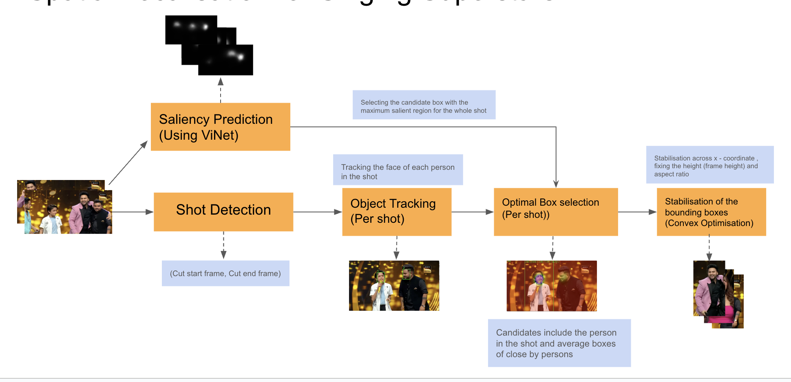

## Setup
* Create a new environment and install the requirements using the following command
```
conda create -n <env_name> python=3.10
conda activate <env_name>
pip install -r requirements.txt
```
* Run the setup.sh file to setup mosek (stablising library) and enter the GEMINI_API_KEY when prompted
```
chmod +x setup.sh
sh setup.sh
```
* Run the webapp using
```
streamlit run Home.py
```

## Setup config.yaml
* root_folder : The root folder where all the data will be stored
* segment_length : The length of the video segments to be generated for passing to Gemini (420 seconds / 7 minutes segments work pretty well)
* overlap : The overlap between the segments (in seconds)
* min_duration : The minimum duration of the video to be considered for spatial processing 
* max_duration : The maximum duration of the video to be considered for spatial processing
* workers_gemini : The number of workers to be used for the gemini processing (recommended 10-15)
* workers_saliency : The number of workers to be used for the saliency processing (10 workers require around 4GB vRAM, set according to GPU capacity)

No need to change other parameters in the config file

## Temporal Detection
1. **Gemini_Inference/gemini_inference.py** : Has functions to generate segments given the videos.
    * We first break the video into segments of 7 minutes each with an overlap of 2 minutes.
    * We then pass these segments to the Gemini API to get the temporal detections.
    * Then we combine the JSONs of the segments to get the final JSON for the episode.
    * Then we use the filters in the webapp/config file to filter out the segments which are not required.
    * Then these segments are stored as mp4 files in the raw_videos folder in the root folder for further spatial processing

## Spatial Detection



### ViNet-Saliency
1. **extract_frames.sh** : extracts the frames from the videos in the episode_folder
    * Input : All the generated shorts from the inference from the previous gemini code which are stored in `/root_folder/<episode_id>/raw_videos/<short_ids>*.mp4`
    * Output : Frames of the videos saved in `/root_folder/<episode_id>/frames/<short_id>/*`
2. **generate_result.py** : Code to give saliency maps from the frames which were generated from the previous command
    * **Code to run this file individually** : 
    ```
    python3 generate_result.py --path_indata <frames_folder> --save_path <saliency_results_folder> --file_weight <vinet_model_path>
    ```
    * Output : saliency maps saved in `saliency_results_folder` `(/root_folder/<episode_id>/saliency_results/<short_id>/frame_***.png)`

<br>

### Vertical Cropping using YOLO and Previous Saliency Outputs

1. **saliency_tracking_pipeline_with_stabilisation.py** : Calls the Short Generator function from `short_generator.py` to create vertical cropped shorts from the videos in `(/root_folder/<episode_id>/raw_videos/)`


**Inside the Short_Generator function**
* **get_shots()** : function to do shot detection in the video to enhance the stability within the shots
* **get_tracking_results()** : runs OC-SORT tracker on each of the previous function's output shots to get the person trajectories
* **get_optimal_boxes()** [IMPORTANT] : Use the tracking results from the previous function and the saliency results from ViNet-Saliency part to determine the optimal box to be displayed for each shot
* **get_stabilised_boxes()** : use the output of the optimal boxes function and uses MOSEC to stabilise any jerks in the output and make the boxes stable and smooth. 


---

### Issues
In case of any problems/updates/suggestions please feel free to contact any of the contributors for the project.
* Hardik Mittal (hardik.mittal@research.iiit.ac.in)
* Sarthak Bansal (sarthak.bansal@students.iiit.ac.in)
* Akshat Shah (akshat.shah@research.iiit.ac.in)